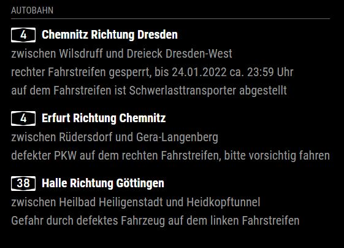

# MMM-Autobahn
**This is a BETA Test! Please report any issues.**

MMM-Autobahn is a simple module which shows traffic-warnings on defined roads and sectors of the german Autobahn network. It uses the official **Autobahn App API** (https://autobahn.api.bund.dev/)

## Preview



## Installation
Go the modules folder of your Mirror
```shell
cd ~/Magic-Mirror/modules/
```
Clone the repository and install the dependencies
```shell
git clone https://github.com/JockeyDoe/MMM-Autobahn
cd MMM-Autobahn
npm install
```
## Config File
Open your config file and add the module

*Sample*
```javascript
//... other modules
{
	module: 'MMM-Autobahn',
	header: 'Verkehrsmeldungen',
	position: "top_right",
	config: {
		reloadInterval: 1000 * 60 * 15, 
		logo_right: false,
		roads: [
			{
				road: "A5",
				from: 10,
				to: 22
			},
			{
				road: "A45"
			}
		]
	}
},
//other modules ...
```
Description of the config fields
|Option|Default|Description|
|--|--|--|
|```reloadInterval```|```1000 * 60 * 15```|Number of ms until a reload of the warning data is performed. Do not fall below 5 minutes.|
|```logo_right```|```false```|Decides whether the logo of the road is displayed left or right of the warning title|
|```roads```||Road objects to fetch and display|
|```road```|```"A5"```|Name of an Autobahn road to fetch. Possible values can be found here: https://verkehr.autobahn.de/o/autobahn/|
|```from``` *(optional)*|```10```|The number of the exit or crossing from which the warnings should be displayed. Can be found on Google Maps or in the Autobahn-Atlas http://www.autobahnatlas-online.de/ (recommended)|
|```to``` *(optional)*|```22```|see "```from```"

If ```from``` or ```to``` are not defined the module will display the whole road. (This is **not** recommended for long roads with one or two digits f.e. "A7" or "A38")

